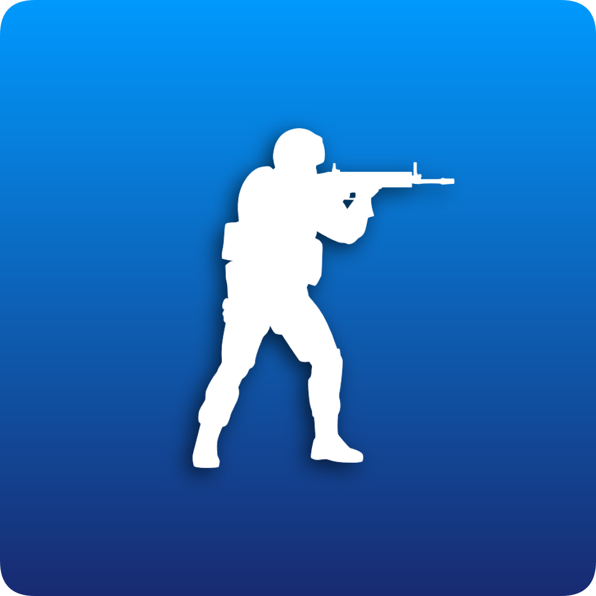

# CS:GO Queue Bot &ensp; [](https://top.gg/bot/539669626863353868)
*A Discord bot to manage and setup CS:GO games*

This script uses the Discord Python API via a bot to manage queues of CS:GO players who want to play with other Discord server members. It is complete with a team drafter, map drafter and a link to a unique PopFlash lobby.


## Setup
1. First you must have a bot instance to run this script on. Follow Discord's tutorial [here](https://discord.onl/2019/03/21/how-to-set-up-a-bot-application/) on how to set one up. Be sure to invite it to a server to use it.

2. (Optional) If you have a Discord Bot List token to use with [top.gg]() then retrieve that from its editing menu.

3. Run `pip3 install -r requirements.txt` in the repository's root directory to get the necessary libraries.

4. Add the `/qbot` path to your `PYTHONPATH` environment variable to be able to import it from anywhere.

5. Using your bot's Discord token and Discord Bot List token, run the bot like so...
```
import qbot

DISCORD_TOKEN = 'XXXXXXXX'
DBL_TOKEN = 'XXXXXXXX'
qbot.run(discord_token=DISCORD_TOKEN, dbl_token=DBL_TOKEN)
```


Now you are ready to start using the CS:GO Queue Bot! Try out some of the commands to make sure it works.

## Commands
`q!help`: Display help menu<br>

`q!about`: Display basic info about this bot<br>

`q!join`: Join the queue<br>

`q!leave`: Leave the queue<br>

`q!view`: Display who is currently in the queue<br>

`q!remove <mention>`: Remove the mentioned user from the queue (Must have server kick perms)<br>

`q!empty`: Empty the queue (Must have server kick perms)<br>

`q!pdraft`: Start (or restart) a team draft from the last popped queue<br>

`q!mdraft`: Start (or restart) a map draft<br>

`q!popflash`: Link the server's designated PopFlash lobby<br>
